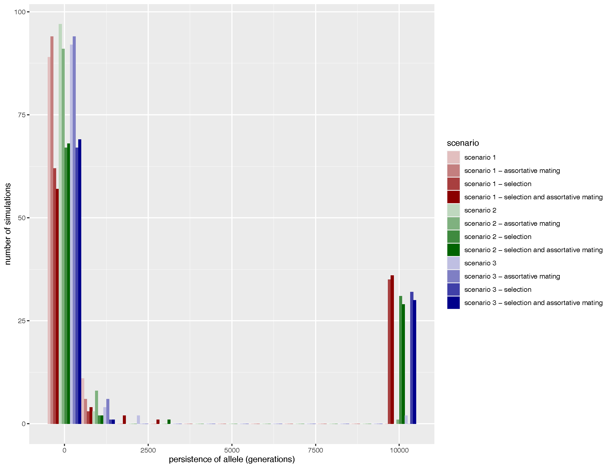
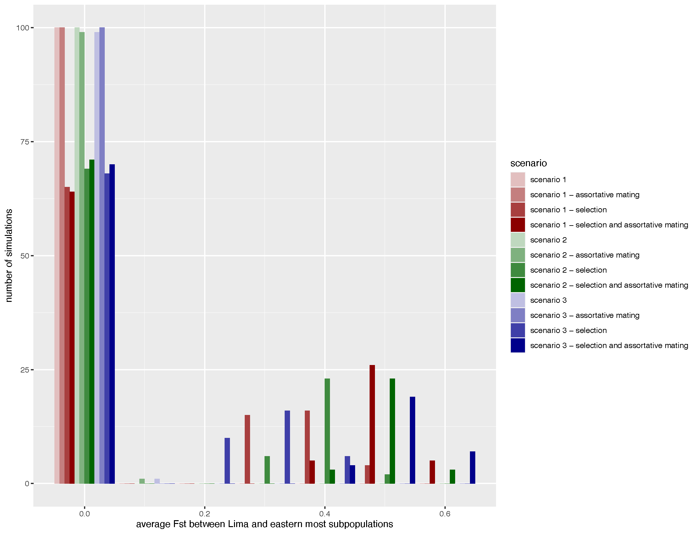

# Melanic allele simulations

### explanation of simulated scenarios
I used SLiM to simulate the melanic allele under 3 stepping stone scenarios. Of course, these scenarios are not fully spatially explicit, but they are quasi spatial because migration is limited in certain directions. SLiM can do fully spatially explicit simulations, but I figured I would try these simpler models first. In all scenarios, migration rates are symmetric and equal to 0.01. The basic structure of the three scenarios is:
* Scenario 1 (stable population size) - 20000 total individuals spread across three linear stepping stone 'fingers' (Chillon, Rimac, and Lurin valleys) connected at the coast. You can click the image to open it in another larger window.

* Scenario 2 (exponential growth) - 9000 individuals at start of simulation with coastal Rimac subpopulation growing exponentially to 12000 individuals by the end of simulation (20000 total individuals at generation 10000). You can click the image to open it in another larger window.

* Scenario 3 (range expansion) - 8000 individuals at start of simulation with coastal Rimac subpopulation seeding new subpopulations in a radial fashion and number of individuals in new subpopulations slowly growing. Each new subpopulation then seeds two more new subpopulations - something I tried to indicate with the red colored lines. The first wave of expansion happens from generation 2-9500 (pre-Colombian habitat expansion from early agriculture). The second wave of expansion happens from generation 9501-9900 (foundation of Lima by Pizzaro and habitat expansion from further agriculture). The thrid wave of expansion happens from generation 9901-10000 (modern Lima and habitat expansion from growth of urban gardens and parks). (20000 total individuals at generation 10000). You can click the image to open it in another larger window.

For each scenario, I ran four seperate simulations treating the melanic allele as neutral, neutral with assortative mating, experiencing spatially varying selection, and experiencing spatially varying selection with assortative mating. Accordingly, there 12 total simulations. For assortative mating, melanics prefer melanics 1% more than red birds, and red birds prefer red birds 1% more than melanics. For spatially varying selection, selection coefficient (s) was 0.01 and spatial variation in selection was achieved by varying the relative fitness (w). Variation in relative fitness was done as follows:

 
 
 

Each simulation was allowed to run for 10000 generations or until the melanic allele went extinct. I first tried to run 10000 replicate simulations per scenario but the scenarios with assortative mating were very slow and I ended up only doing 100 replicate simulations per scenario for the results. For each replicate simulation I recorded how many generations the melanic allele persisted for and calculated the average Fst between coastal and eastern-most subpopulations in the final generation. This of course means that Fst is 0 for every simulation where the melanic allele went extinct. My thought was to show that a scenario without selection would almost always result in the melanic allele being lost before 10000 generations (i.e. present time). By calculating Fst between coastal and eastern subpopulations I hoped to show that even if the melanic allele persisted 10000 generations under a neutral scenario, there would not be subpopulation structure in its frequency. In other words, for a scenario to match the melanic allele frequencies we observed in 2011, the melanic allele would have to be present after 10000 generations and show subpopulation structure. 

### results
Here are the results. It is pretty much exactly what one would expect - the melanic allele quickly goes extinct under neutral scenarios but persists and achieves supopulation structure in its frequency under scenarios with selection. I guess the only interesting thing is that my attept to simulate allele surfing did not result in the melanic allele persisting until generation 10000. I am not sure how convincing any of this is but perhaps addresses Robb's comment that we hadn't ruled out neutral alteratives such as allele surfing...

 
