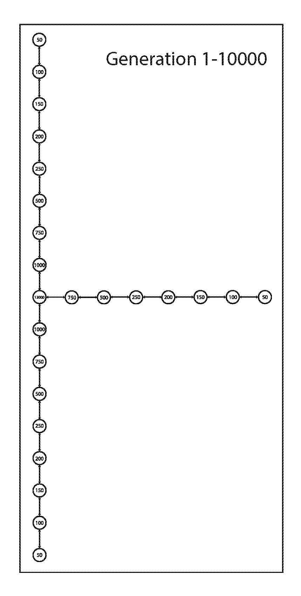
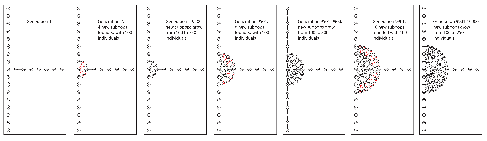
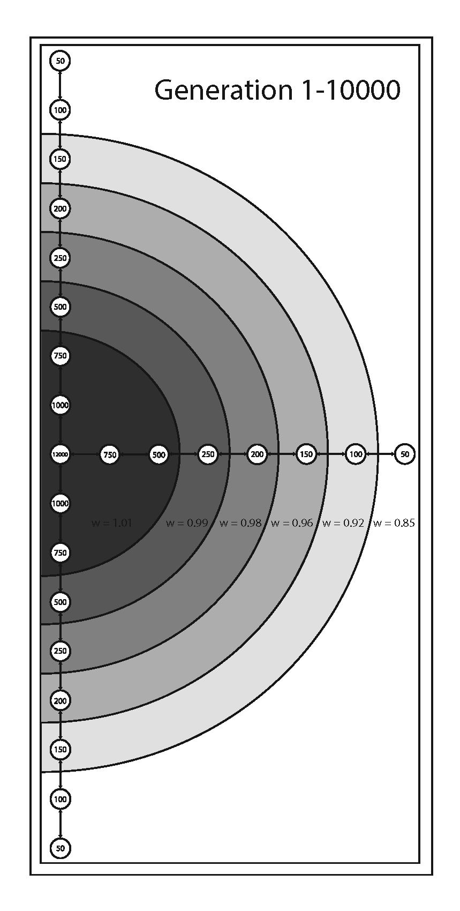
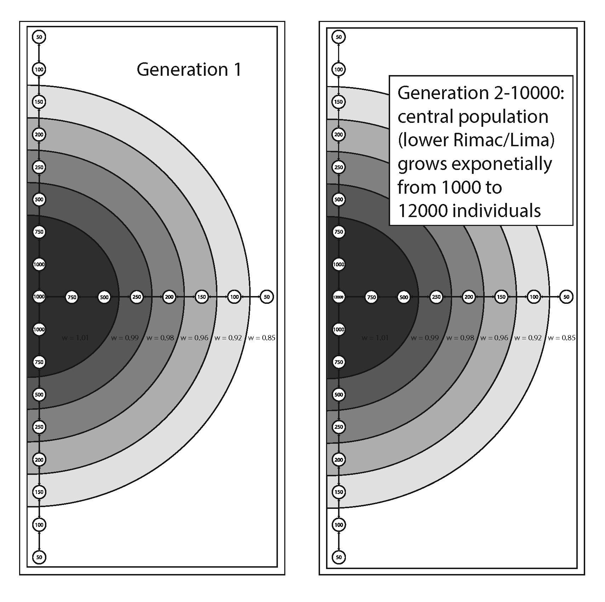
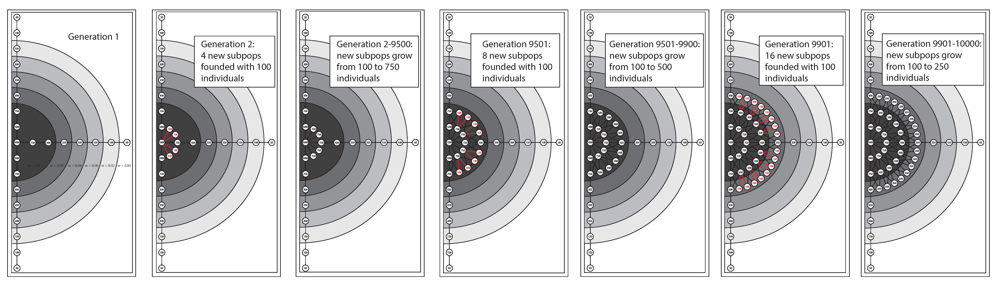

# Melanic allele simulations

I used SLiM to simulate the melanic allele under 3 stepping stone scenarios. Note that these are not fully spatially explicit, but they are quasi spatial because migration is limited in certain directions. SLiM can do fully spatially explicit simulations, but I figured I would try these simpler models first. In all scenarios, migration rates are symmetric and 0.01. The basic structure of three scenarios is:
* stable population size - 20000 total individuals spread across three linear stepping stone 'fingers' (Chillon, Rimac, and Lurin valleys) connected at the coast. You can click the image to open it in another larger window.

* exponential growth - 9000 individuals at start of simulation with coastal Rimac subpopulation growing exponentially to 12000 individuals by the end of simulation. You can click the image to open it in another larger window.

* range expansion - 8000 individuals at start of simulation with coastal Rimac subpopulation seeding new subpopulations in a radial fashion and number of individuals in new subpopulations slowly growing. Each new subpopulation then seeds two more new subpopulations. The first wave of expansion happens from generation 2-9500 (pre-Colombian habitat expansion from early agriculture). The second wave of expansion happens from generation 9501-9900 (foundation of Lima by Pizzaro and habitat expansion from further agriculture). The thrid wave of expansion happens from generation 9901-10000 (modern Lima and habitat expansion from growth of urban gardens and parks). You can click the image to open it in another larger window.

For each scenario, I ran four seperate simulations treating the melanic allele as neutral, neutral with assortative mating, experiencing spatially varying selection, and experiencing spatially varying selection with assortative mating. For assortative mating, melanics prefer melanics 1% more than red birds, and red birds prefer red birds 1% more than melanics. For spatially varying selection, selection coefficient (s) was 0.01 and spatial variation in selection was achieved by varying the relative fitness (w). Variation in relative fitness was done as follows:

 
 
 
