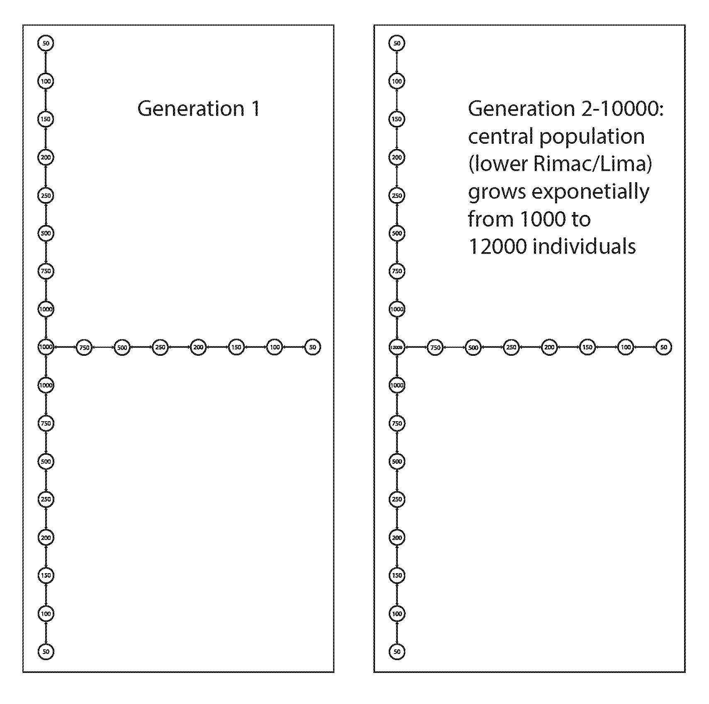

# Melanic allele simulations

I used SLiM to simulate the melanic allele under 3 stepping stone scenarios. Note that these are not fully spatially explicit, but they are quasi spatial by limiting migration in certain directions. SLiM can do fully spatially explicit simulations, but I figured I would try these simpler models first. The three scenarios are:
* stable population size - 20000 total individuals spread across three linear stepping stone 'fingers' (Chillon, Rimac, and Lurin valleys) connected at the coast.

* exponential growth - 9000 individuals at start of simulation with coastal Rimac subpopulation growing exponentially to 12000 individuals by the end of simulation.

* range expansion - 8000 individuals at start of simulation with coast Rimac subpopulation seeding new subpopulations in a radial fashion and number of individuals in new subpopulations slowly growing. First wave of expansion from generation 2-9500 (pre-Colombian habitat expansion from early agriculture). Second wave of expansion from generation 9501-9900 (foundation of Lima by Pizzaro and habitat expansion from further agriculture). Thrid wave of expansion from generation 9901-10000 (modern Lima and habitat expansion from growth of urban gardens and parks).

